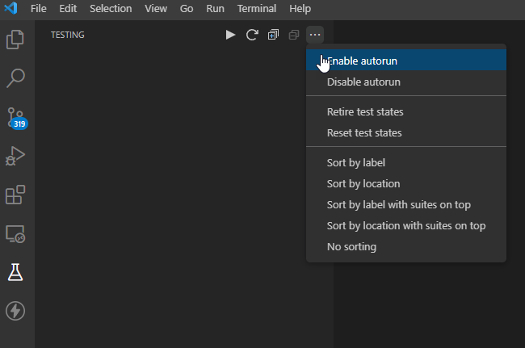

# Setup

## A. Documentation Convention

The documentation will contain code snippets and instructions for terminal commands shown as code boxes. We will adopt the following convention when explaining the instructions.

---

### 1. Terminal Input

-   The code box for terminal input will begin each line with a `$` character denoting the command prompt. When reading the instructions, enter the commands that comes after the `$` but do not include the `$` character in your input.
-   We will use `#` to denote the example output that will be returned from running the command. Do not enter anything from the line starting with `#`.

    ```sh
    $ this is a command
    $
    # this is the output returned from your command
    ```

---

### 2. Commandline Console

-   Sometimes, we will be issuing command into a commandline tool, for instance, the Hardhat Console.
-   Similar to terminal commands, we will precede any instructions with the `>` which denotes the command prompt in a commandline console. Enter the commands that comes after the `>` but do not include the `>` in your input.
-   We will use // to denote the example output that will be returned from running the command.

    ```js
    > let account = ethers.getSigner();
    > account
    // '0x167081A9f679a73ED3984265Ca84b91F8b19Cf15'
    ```

---

### 3. Javascript

-   Javascript code snippets will be shown as Javascript but can contain `...` which represent additional code fragment that can exist but is relevant to the current context.
-   Do not enter the `...` as part of your code but replace it with relevant code when required.

    ```js
    function hello() {
        ...
    }
    ```

---

### 4. Solidity

-   Solidity code snippets will be shown as Solidity but can contain `...` which represent additional code fragment that can exist but is relevant to the current context.
-   Do not enter the `...` as part of your code but replace it with relevant code when required.

    ```sol
    contract Hello {

        constructor(address owner)
        {
            ...
            transferOwnership(owner);
        }

    }
    ```

---

### 5. Quotation Marks

-   Use only straight quotation marks - either ' or " or `.
-   Do not use any curly quotation in your lab, eg. ‘ or ’ or “ and ”

---

## B. Visual Studio Code Extensions for Solidity

---

### 1. Solidity by Juan Blanco (WSL)

This is a Solidity language extension for VS Code providing syntax highlighting, compilation, and code completion. There is a similar one called Solidity by Hardhat but you cannot install both due to the prettier conflict.

Make sure you update the settings.json file with the following to enable formatting:

```json
    "solidity.formatter": "prettier",
    "[solidity]": {
        "editor.defaultFormatter": "JuanBlanco.solidity"
    }
```

---

### 2. Mocha Test Explorer (Optional)

Run unit tests in sidebar. Installing this extension will install the following extensions:

-   Test Adapter Converter
-   Test Explorer UI

---

#### Step 1. Install Mocha Test Explorer

**a) Install Mocha Test Explorer extension**

This will install `Mocha Test Explorer` and `Test Explorer UI`

**b) Configure Test Explorer for Hardhat**

Refer [here](https://hardhat.org/guides/vscode-tests) for details.

**c) Add the file .mocharc.json at the project directory.**

    ```
    {
        "require": "hardhat/register",
        "timeout": 40000
    }
    ```
    NOTE: By default timeout is 20000. This is fine for testing with local network but this will not be enough when testing an API call to testnet.

**d) Update VS Code settings**

`CTRL` + `,` to open settings.json and add `"mochaExplorer.configFile": ".mocharc"` to the config.

---

#### Step 2. Enable Autorun Test

This is optional. IT will autorun the test in the /test directory from Hardhat project directory whenever the test JS file is saved.

To enable this, click on `Test Explorer UI` sidebar and `...` to `Enable autorun`.

    
