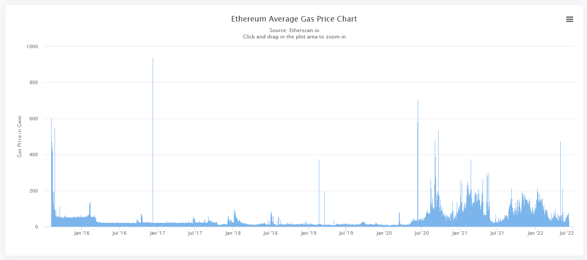

# Lesson 8 - Transactions and Gas

The Ethereum blockchain adopts a dual token model - Gas and Ether. The former determines the cost of using Smart Contract, which has a major influence on the way you write your smart contracts. Gas is the key contributing factor to what makes Solidity unique as compared to other languages. A clear understanding of gas and its impact on your design is a necessity for smart contract developers.

**NOTE:**

-   Since the London hardfork (EIP1559) introduced in 2021, the network will start taking some ETH out of circulation by destroying(burn) the base fee component of the gas fee paid for every transaction.

## 1. Gas (Gas Unit)

https://ethereum.org/en/developers/docs/gas/

-   Gas refers to the unit that measures the amount of computational effort required to execute specific operations on the Ethereum network.

-   All operations on Ethereum requires Gas.

-   The **relationship between operations and gas is fixed** by the protocol.

---

## 2. Gas Cost and Transaction Cost

-   An Ethereum transaction is made up of a sequence of low-level operations executed by the Ethereum Virtual Machine (EVM aka node).

-   Each operation is associated with a fixed cost determined by the protocol specified in the Yellow Paper https://ethereum.github.io/yellowpaper/paper.pdf (Appendix G).

-   The cost of each operation (in Gas) is known as its **Gas Cost** and the cost of a transaction (in Gas) is the sum of all its operation's Gas Cost known as **Transaction Cost**.

-   For example, according to the Yellow Paper (Gtransaction), each transaction costs will cost at least 21,000 Gas Units and an operations such as Gsset costs 20,000 Gas Units for storing a 32-bytes word on the blockchain.

    

-   Because transactions requires gas to run, gas is paid for with ETH and ETH is finite, this is how Ethereum solves the halting problem - indefinite use of resources that stops network from converging to a definite state, eg infinite loop.

-   **The relationship between Gas and Ether is not fixed.** This give rise to the Gas/Ether market and is largely driven by demand(sender) and supply(miner).

---

## 3. Lab 8a : Minimum Transaction Cost

Refer to "lab-8.ipynb" for the lab exercise

---

## 4. Gas Price

-   The **Gas Price** is the price the **sender** is willing to pay for each unit of gas in gwei (10^9) units of Ether. The **Gas Price** is what miners use to determine the priority of including your transaction into a block to be mined. This value can be adjusted in the wallet application when sending your transaction.

-   When more senders are competing to send their transactions earlier than others, this drives up the demand. Therefore, the higher the price you will pay for gas in order for your transaction to be mined. The car is a common analogy used to illustrate this. The amount of gas consumption is determined by the car's design but the cost of driving a car is determined by the price of gas.

    ### History of Gas Price

    Ethereum gas prices are highly volatile. It hovers around 20-50 gwei in general but can easily cross the 100 gwei mark during peak. (the highest recorded spike is more than 900).

    

---

## 5. Lab 8b : Transfer ETH with GasPrice

Refer to "lab-8.ipynb" for the lab exercise

---

## 6. Cost of Transaction in USD

-   You can check the market rate of gas price here https://ethgasstation.info/. For example, if the gas market price is currently 30 gwei, the cost of the transaction in ETH is at least 63 x 10^12 wei or 63 x 10^-5 ETH.

-   If the ETHUSD market price is currently US\$2000 per ETH, that means the transaction costs is at least USD 126 x 10^-2 (US$1.26).

---

## 7. Gas Limit

-   Certain transactions has variable gas cost such as sending an array of bytes that gets stored on the blockchain which ultimately determines the actual cost.

-   **Gas Limit** determines the maximum amount of gas you are willing to pay for the cost of a transaction (Gas Unit). It is a safety mechanism to prevent a transaction from emptying your wallet if it becomes too expensive(eg. running into an infinite loop).

-   An account must have enough ether to cover the gas (at the specified gasPrice). Any unused gas is refunded at the end of the transaction, and if there is insufficient gas to complete execution, the effects of the transaction are reverted, but the gas is fully consumed and an **out-of-gas** error occurs.

---

## 8. Lab 8 - Transaction Cost

Refer to "lab-8.ipynb" for the lab exercise
